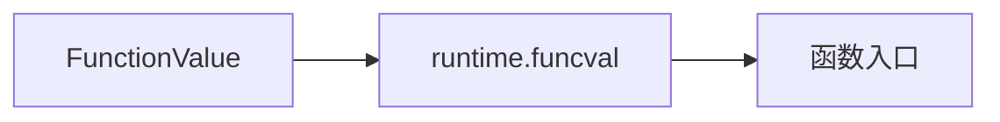

# 闭包

> 推荐学习：[【Golang】图解Function value](https://mp.weixin.qq.com/s/iFYkcLbNK5pOA37N7ToJ5Q)

## 函数

函数，`Go` 语言中属于头等对象，你可以作为参数进行传递，也可以作为函数返回值，绑定到变量，甚至可以作为一种类型。`Go` 语言称这样的参数、返回值和变量为**“Function Value”**。

`Function Value` 本质上是一个指针，却不直接指向函数指令入口，而是指向 `runtime.funcval` 结构体。

```go
type funcval struct {
    //uintptr 是一个整数类型，它大到足以容纳任何指针的位模式。
    fn uintptr
}
```

从结构体的字段定义来看，似乎是一个地址，这个地址应该就是函数入口了。

通过以下方式找到函数入口：



举个例子🌰：

```go
func A(i int) {
    i++
    fmt.Println(i)
}  
func B(){
    f1 := A
    f1(1)
}
func C(){
    f2 := A
    f2(1)
}
```

在这个函数中，多个变量都用到一个函数 A，那么编译器在编译阶段就会做出一定的优化，让他们都共用一个 `funcval` 结构体。在执行阶段，就会去使用它。

> ❓：明明可以直接调用函数入口，为什么要通过 `funcval` 结构体包装函数入口地址，然后使用一个二级指针来调用呢？

## 闭包

### 介绍

> 维基百科
>
> 在计算机科学中，闭包（英语：Closure），又称词法闭包（Lexical Closure）或函数闭包（function closures），是在支持头等函数的编程语言中实现词法绑定的一种技术。闭包在实现上是一个结构体，它存储了一个函数（通常是其入口地址）和一个关联的环境（相当于一个符号查找表）。环境里是若干对符号和值的对应关系，它既要包括约束变量（该函数内部绑定的符号），也要包括**自由变量（在函数外部定义但在函数内被引用）**，有些函数也可能没有自由变量。闭包跟函数最大的不同在于，**当捕捉闭包的时候，它的自由变量会在捕捉时被确定，这样即便脱离了捕捉时的上下文，它也能照常运行。**

举个例子🌰：

```go
func create() func(){
    c := 2
    return func(){
        fmt.Println(c)
    }
}
func main(){
    f1 := create()
    f2 := create()
    f1()
    f2()
}
```

* `create` 函数的返回值是一个函数，这个函数引用了 `create` 函数的局部变量 `c`。满足拥有自由变量。
* `f1 := create()` 结束后，依然可以通过 `f1()` 可以正常执行函数，同时去使用捕获到的自由变量 `c`。

根据上面两个定义结合维基百科的解释，create 的返回值函数满足闭包的定义，这个自由变量 `c` 通常被称之为 **捕获变量**。

虽然create函数的返回值函数形成闭包，但是Go语言里并没有把闭包从 `Function Value` 中特别区分出来。**在Go语言中闭包只是拥有一个或多个捕获变量的Function Value而已**。这些捕获变量就是它的捕获列表，就放在对应的`funcval` 结构体的后面。


每个闭包对象都是一个`Function Value`，但是各自持有自己的捕获列表，这也是称闭包为**“有状态的函数”**的原因。

### 调用捕获变量

* 当 `Function Value` 调用函数时候，会将二级地址也就是 `funcval` 结构体地址存入特定寄存器，例如`amd64` 平台使用的是 `DX` 寄存器。
* 当闭包函数执行时候，就可以通过寄存器存储地址加上偏移量找到自己的捕获变量。
* 如果是没有捕获列表的 `Function Value`，直接忽略这个寄存器即可。通过这样的方式，`Go` 语言实现了对 `Function Value` 的统一调用。


### 捕获列表

捕获列表变量时怎么来的？值拷贝？存储地址？这是一问题。

注意点：**闭包捕获的变量要在闭包函数和外层函数中表现一致。**

如果是值拷贝，就**无法保证闭包捕获的变量要在闭包函数和外层函数中表现一致**，所以编译器对捕获变量的不同情况做出不同的处理。请记住：无论做什么处理，只有一个目的：**闭包捕获的变量要在闭包函数和外层函数中表现一致**。

* 捕获变量进行初始化赋值，就没有再次修改了
* 捕获变量初始化赋值，还被修改过。
  * 捕获变量是局部变量
  * 捕获变量是参数
  * 捕获变量是返回值

> 初始化赋值，不再修改

```go
func create() func(){
    c := 2
    return func(){
        fmt.Println(c)
    }
}
func main(){
    f1 := create()
    f2 := create()
    f1()
    f2()
}
```

他的捕获变量初始化赋值后，之后再也没有修改了，那么这个捕获变量就直接拷贝值，然后放到 `funcval` 结构体后面。

> 捕获局部变量

```go
func create() (fs [2]func()){
    for i := 0; i < 2; i++ {
        fs[i] = func(){
            fmt.Println(i)
        }    
    }
    return
}
func main() {
    fs := create()
    for i := 0; i < len(fs); i++ {
        fs[i]()
    }
}
```

在这个例子中，捕获变量是局部变量 i，经过初始化赋值后，还被修改过。这个局部变量会被改为堆分配。

流程如下：

* 在 `create` 函数栈帧中，局部变量 `i` 被闭包捕获，因为后续会更改，所以就会被分配到堆上，在栈上的局部变量空间会存储他在堆上的地址，`for` 循环还没有开始，`i` 等于 `0`。
* 第一次 `for` 循环，就会在堆上创建一个 `funcval` 结构体，指向闭包函数入口，同时后面是捕获变量 `i` 的地址。`i` 自增加一，注：**`create` 函数与闭包函数 共用一个堆。**
* 第二次 `for` 循环，操作同上
* 返回值空间分别是两次创建的 `funcval` 结构体的地址 `addr1,addr2`。
* `fs` 的变量空间分别被返回值进行赋值
* 通过多次地址指向，执行 `fs` 空间对应的函数，此时输出的 `i` 的值就是分配到堆上捕获变量 `i` 的值。所以只会输出 `2`。

上面的流程的目的只有一个：**闭包捕获的变量要在闭包函数和外层函数中表现一致。**


> 捕获参数

如果是参数被捕获，那么调用者依然从栈上传递参数，但是被调用函数会把它拷贝到堆上一份，然后和闭包函数都使用堆上分配的那一个。方式与捕获局部变量一致。

> 捕获返回值

如果是返回值被捕获，那么处理方式就又有些不同了。返回值空间依然由调用者在栈上分配，但是被调用函数（闭包的外层函数）会在堆上也分配一个，并且与闭包函数都使用堆上这一个。但是，在外层函数返回前要把堆上的返回值拷贝到栈上那一个。


注：闭包对于捕获变量所有的操作，目的只有一个：**闭包捕获的变量要在闭包函数和外层函数中表现一致。**

